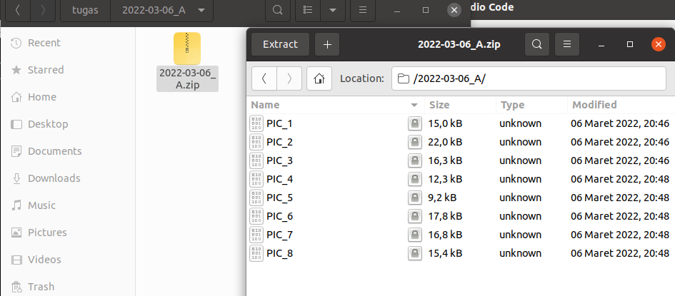

# soal-shift-sisop-modul-1-ITA13-2022

Sisop modul 1

| NRP        | Nama                            |
| ------------ | --------------------------------- |
| 5027201052 | Abadila Barasmara Bias Dewandra |
| 5027201055 | Banabil Fawazaim Muhammad       |

# Soal 1

source [code](https://gitlab.com/sisop_warrior/soal-shift-siop-modul-1-it13-2022/-/tree/main/soal1)

*Terdapat 2 source code yaitu 
[register.sh](https://gitlab.com/sisop_warrior/soal-shift-siop-modul-1-it13-2022/-/blob/main/soal1/register.sh) 
untuk menangani register user dan 
[main.sh](https://gitlab.com/sisop_warrior/soal-shift-siop-modul-1-it13-2022/-/blob/main/soal1/main.sh) yang menangani kegiatan login user*

**Deskripsi Soal**

Pada suatu hari, Han dan teman-temannya diberikan tugas untuk mencari foto. Namun, karena laptop teman-temannya rusak ternyata tidak bisa dipakai karena rusak, Han dengan senang hati memperbolehkan teman-temannya untuk meminjam laptopnya. Untuk mempermudah pekerjaan mereka, Han membuat sebuah program.

### Soal 1a.

**Deskripsi Soal**

Han membuat sistem register pada script register.sh dan setiap user yang berhasil didaftarkan disimpan di dalam file ./users/user.txt. Han juga membuat sistem login yang dibuat di script main.sh

**Pembahasan**

Kita akan membuat 2 file shell yaitu 
[register.sh](https://gitlab.com/sisop_warrior/soal-shift-siop-modul-1-it13-2022/-/blob/main/soal1/register.sh) menangani register user baru
dan 
[main.sh](https://gitlab.com/sisop_warrior/soal-shift-siop-modul-1-it13-2022/-/blob/main/soal1/main.sh) yang menangani kegiatan login user*


### Soal 1b.

**Deskripsi Soal**

Demi menjaga keamanan, input password pada login dan register harus tertutup/hidden dan password yang didaftarkan memiliki kriteria sebagai berikut

* Minimal 8 karakter
* Memiliki minimal 1 huruf kapital dan 1 huruf kecil
* Alphanumeric
* Tidak boleh sama dengan username

**Pembahasan**

Disini kita mengatur username dan password yang dimasukan oleh user baru pada saat register di [register.sh](https://gitlab.com/sisop_warrior/soal-shift-siop-modul-1-it13-2022/-/blob/main/soal1/register.sh). Pertama-tama, kita akan meminta username dan password terlebih dahulu kepada user baru dengan menyembunyikan ketikan password dengan `-s`

```
read -p "Username: " username
read -s -p "Password: " password
```

Lalu kita cek panjang `password` apakah sudah lebih dari sama dengan 8 dengan menggunakan `test $len -ge 8` dimana `len` adalah variabel yang akan mengambil panjang dari string `password` seperti ini `len="${#password}"`

Setelah panjang `password` dicek kita akan mengecek alphanumeric dengan seperti ini 

```
if ! [[ "$password" =~ [^a-zA-Z0-9\ ] ]];
```

Untuk pengecekan keberadaan huruf kapital di `password` kita akan menggunakan line `echo "$password" | grep -q [A-Z]` dimana akan mengeluarkan 0 jika huruf kapital ada dan 1 jika huruf kapital tidak ada di `password`

Hal ini berlaku juga pada saat pengecekan huruf kecil di `password`

Setelah `password` sudah sesuai dengan kriteria maka kita akan mengecek apakah `password` dan `username` itu tidak sama

Lalu `username` akan dicek apakah sudah unik dari data `users/user.txt` dengan menggunakan `awk -v var="$username" '{ if( $1==var) printf "%s\n", $1}' users/user.txt` jika hasil `awk` tidak mengeluarkan apa-apa, berarti `username` adalah unik dan data `username` dan `password` akan dimasukan ke dalam `users/user.txt` .


### Soal 1c.

**Deskripsi Soal**

Setiap percobaan login dan register akan tercatat pada log.txt dengan format : MM/DD/YY hh:mm:ss MESSAGE. Message pada log akan berbeda tergantung aksi yang dilakukan user.

* Ketika mencoba register dengan username yang sudah terdaftar, maka message pada log adalah REGISTER: ERROR User already exists

* Ketika percobaan register berhasil, maka message pada log adalah REGISTER: INFO User USERNAME registered successfully

* Ketika user mencoba login namun passwordnya salah, maka message pada log adalah LOGIN: ERROR Failed login attempt on user USERNAME

* Ketika user berhasil login, maka message pada log adalah LOGIN: INFO User USERNAME logged in

**Pembahasan**

Pada setiap kegiatan user di 
[register.sh](https://gitlab.com/sisop_warrior/soal-shift-siop-modul-1-it13-2022/-/blob/main/soal1/register.sh) 
dan 
[main.sh](https://gitlab.com/sisop_warrior/soal-shift-siop-modul-1-it13-2022/-/blob/main/soal1/main.sh) akan kita masukan ke dalam `users/log.txt` dan setiap ERROR dan SUCCESS yang dilakukan oleh user akan dituliskan dengan `echo "$(date +%D) $(date +%T) **MESSAGE**" >> users/log.txt` dimana `>>` akan menambah log ke file `log.txt`.

Untuk pengecekan login dari user kita akan menggunakan `awk` `username` dan `password` ke `user.txt`. Jika hasil `awk` ada maka user berhasil login.


### Soal 1d.

**Deskripsi Soal**

Setelah login, user dapat mengetikkan 2 command dengan dokumentasi sebagai berikut :

* dl N ( N = Jumlah gambar yang akan didownload)

Untuk mendownload gambar dari https://loremflickr.com/320/240 dengan jumlah sesuai dengan yang diinputkan oleh user. Hasil download akan dimasukkan ke dalam folder dengan format nama YYYY-MM-DD_USERNAME. Gambar-gambar yang didownload juga memiliki format nama PIC_XX, dengan nomor yang berurutan (contoh : PIC_01, PIC_02, dst. ).  Setelah berhasil didownload semua, folder akan otomatis di zip dengan format nama yang sama dengan folder dan dipassword sesuai dengan password user tersebut. Apabila sudah terdapat file zip dengan nama yang sama, maka file zip yang sudah ada di unzip terlebih dahulu, barulah mulai ditambahkan gambar yang baru, kemudian folder di zip kembali dengan password sesuai dengan user.

* att

Menghitung jumlah percobaan login baik yang berhasil maupun tidak dari user yang sedang login saat ini.

**Pembahasan**

Untuk fungsi dl atau download gambar kita akan mengecek apakah terdapat zip di dalam direktori. Jika tidak ada, maka akan dibuat direktori baru. Jika ada, maka akan di unzip, diambil jumlah file yang terdapat di zip tersebut dengan `zipinfo` dimasukan ke dalam variabel `hitung`, baru `hitung` akan diubah menjadi integer dengan tambah 1 dan kurang 1, dan terakhir zip tersebut dihapus.

Lalu untuk penamaan file yang akan didownload kita akan menggunakan acuan `hitung` kalau ini adalah pertama kali zip, maka akan dijadikan 1. Lalu kita akan menggunakan loop sebanyak N untuk mendownload dan penamaan gambar yang didownload.

Setelah gambar sudah didownload dan dinamai, kita akan zip direktori tersebut dan menghapus gambar-gambar tadi.

Untuk fungsi att kita akan menggunakan 2 awk dimana awk pertama akan mencari line `LOGIN: INFO User $username logged in` dengan acuan `$username` sebagai nama user yang sedang dicari dan `LOGIN: ERROR Failed login attempt on user $username` dengan metode yang sama.


Download pertama


Download Kedua



Pemanggilan att:


## Kendala yang dialami
1. Di register, output untuk feedback user tidak ada, tetapi asisten tidak mempersoalkan tersebut.


# Soal 2

Pembahasan soal no 2


## Pembahasan soal

Membuat soal script yang menscan file log dari website [berikut](https://daffa.info). 
1. Periksa apakah folder/directory  forensic_log_website_daffainfo_log 
```bash
if [ ! -d ./ forensic_log_website_daffainfo_log ] then
    mkdir ./ forensic_log_website_daffainfo_log
fi
```


2. Untuk mencari rata-rata, ambil string jam tiap request. lalu masukkan ke dalam array  tiap jam. Saat dimasukkan, tambah nilai 1. Kemudian lakukan loop untuk menghitung banyak jam dan menjumlah total akses tiap jam. Kemudian bagi jumlah akses dengan total jam untuk mencari rata-rata. Output dimasukkan ke dalam rata-rata.txt.
```bash


#menghitung rata-rata
cat log_website_daffainfo.log | awk '{gsub(/"/, "", $1); print $1 }' | awk -F: '/2022/ {gsub(/:/, " ", $1); arr[$3]++}
		END {
            hasil=0
			for (i in arr) {
				count++
				res+=arr[i]
			}
			hasil=res/count
			printf "rata rata serangan perjam adalah sebanyak %.3f request per jam %d %d\n\n", hasil, count, res
		}' >> ./folder/ratarata.txt
```
dimana ```awk '{gsub(/"/, "", $1); print $1 }' | awk -F: '/2022/ {gsub(/:/, " ", $1); arr[$3]++} ``` berfungsi untuk mengambil string jam masing-masing dan memasukkan nilai ke dalam array sekaligus increment value dari alamat array tersebut agar menyimpan berapa banyak ip address yang mengakses pada jam itu.
Setelah itu dilakukan algoritma rata-rata dengan menghitung total aktivitas dibagi jam yang ada.


3. Untuk mencari IP address terbanyak, ambil string IP address pertama. lalu masukkan ke dalam string, yang mana akan tambah satu tiap string sama ditemukan. Lalu melakukan algoritma menemukan nilai terbesar dalam array.
```bash
cat log_website_daffainfo.log | awk '{gsub(/,/, " ", $1); print $1 }' | awk -F: '{gsub(/:/, " ", $1); arr[$1]++}
    END {
        big=0
        flag
        for (i in arr) {
            if (big < arr[i]) {
                flag=i
                big=arr[flag]
            }
        }
        print "yang paling banyak mengakses server adalah: " flag " sebanyak " big " request\n"
    }' >> ./folder/result.txt
```
dimana ``` awk '{gsub(/,/, " ", $1); print $1 }' | awk -F: '{gsub(/:/, " ", $1); arr[$1]++}``` berfungsi untuk melihat alamat IP address di string dan menyimpannya ke dalam array sekaligus increment value array setiap nilai yang sama. lalu lakukan algortima mencari nilai terbesar.

4. Untuk mencari curl, tinggal mencari kata kunci curl dengan awk.
```bash
cat log_website_daffainfo.log | awk '/curl/ { ++n } END {
    print "ada " n " request yang menggunakan curl sebagai user-agent\n"}' >> ./folder/result.txt
```
dimana ```awk '/curl/ { ++n }``` berfungsi untuk menghitung line log yang mengandung string curl.


5. Untuk melihat ip address yang mengakses pa jam 2 pagi, mengambil string jam. Lalu masukkan ke dalam array. lalu print array yang mengakses pada pukul 2 pagi.
```bash
cat log_website_daffainfo.log | awk -F: '/2022:02/ {gsub(/"/, "", $1) arr[$1]++ }
    END {
        for (i in arr) {
            print i " mengakses website pada jam 2 pagi"
        }
     }' >> ./folder/result.txt
``` 
dimana```awk -F: '/2022:02/ {gsub(/"/, "", $1) arr[$1]++ }``` berfungsi untuk memasukkan IP address di paremeter pertama ke dalam array. (untuk perhitungan di biarkan ada)


## Kendala yang dialami
1. Awal-awal masih tidak tahu cara mengakses log di website, tetapi baru ditemukan file lognya H-1.
2. Terdapat revisi untuk mencari rata-rata dimana kami memasukkan line pertama yang mana merupakan cara membaca format lognya. Sehingga, solusi yang kami dapatkan adalah mencari string yang dimiliki log yang dimaksud tanpa memasukkan line pertama ke dalam perhitungan, yakni dengan menambahkan /2022/ ke dalam awk sehingga menjadi ```awk -F: '/2022/ {gsub(/:/, " ", $1); arr[$3]++}```

# Soal 3

source [code](https://gitlab.com/sisop_warrior/soal-shift-siop-modul-1-it13-2022/-/tree/main/soal3)

*Terdapat 2 code yaitu [minutes_log.sh](https://gitlab.com/sisop_warrior/soal-shift-sisop-modul-1-ita13-2022/-/blob/main/soal3/minute_log.sh) untuk pencatatan log per menit dan [aggregate_minutes_to_hourly.sh](https://gitlab.com/sisop_warrior/soal-shift-sisop-modul-1-ita13-2022/-/blob/main/soal3/aggregate_minutes_to_hourly_log.sh) yang menangani pencatatan log per jam berdasarkan log per menit*

**Deskripsi Soal**

Ubay sangat suka dengan komputernya. Suatu saat komputernya crash secara tiba-tiba :(. Tentu saja Ubay menggunakan linux. Akhirnya Ubay pergi ke tukang servis untuk memperbaiki laptopnya. Setelah selesai servis, ternyata biaya servis sangatlah mahal sehingga ia harus menggunakan dana kenakalannya untuk membayar biaya servis tersebut. Menurut Mas Tukang Servis, laptop Ubay overload sehingga mengakibatkan crash pada laptopnya. Karena tidak ingin hal serupa terulang, Ubay meminta kalian untuk membuat suatu program monitoring resource yang tersedia pada komputer.

Buatlah program monitoring resource pada komputer kalian. Cukup monitoring ram dan monitoring size suatu directory. Untuk ram gunakan command `free -m`. Untuk disk gunakan command `du -sh <target_path>`. Catat semua metrics yang didapatkan dari hasil `free -m`. Untuk hasil `du -sh <target_path>` catat size dari path directory tersebut. Untuk target_path yang akan dimonitor adalah /home/{user}/.


### Soal 3a.

**Deskripsi Soal**

Masukkan semua metrics ke dalam suatu file log bernama metrics_{YmdHms}.log. {YmdHms} adalah waktu disaat file script bash kalian dijalankan. Misal dijalankan pada 2022-01-31 15:00:00, maka file log yang akan tergenerate adalah metrics_20220131150000.log.

**Pembahasan**

Disini kita akan membuat file bernama `minute_log.sh` dimana file ini akan menangani pencatatan log dari `free -m` dan `du -sh <target_path>`. Untuk target pathnya kita bisa menggunakan variabel `saya` untuk menyimpan `$(whoami)` dimana itu untuk mendapatkan data nama usernya lalu ditempel ke `/home/$saya`. Dalam mendapatkan nilainya nanti dalam pemanggilan `free -m` akan di awk kan yang pertama Memnya lalu Swapnya Dimana urutan nilainya tidak akan berubah-ubah untuk pemanggilan sebanyak apapun. Lalu dalam mendapatkan nilai `du -sh <target path>` akan diawk juga dengan mengambil nilai yang pertama. Setelah datanya didapatkan akan disambungkan, dan diprint bersama dengan line `mem_total,mem_used,mem_free,mem_shared,mem_buff,mem_available,swap_total,swap_used,swap_free,path,path_size` sebagai persyaratan yang ada di soal.

### Soal 3b.

**Deskripsi Soal**

Script untuk mencatat metrics diatas diharapkan dapat berjalan otomatis pada setiap menit.

**Pembahasan**

Untuk otomatisasinya akan ditangani oleh cron dimana linenya adalah 

```
* * * * * /{path file}/minute_log.sh
```

Dan kita menggunakan `* * * * *` karena ini adalah menjalankan tugasnya setiap menit.

### Soal 3c.

**Deskripsi Soal**

Kemudian, buat satu script untuk membuat agregasi file log ke satuan jam. Script agregasi akan memiliki info dari file-file yang tergenerate tiap menit. Dalam hasil file agregasi tersebut, terdapat nilai minimum, maximum, dan rata-rata dari tiap-tiap metrics. File agregasi akan ditrigger untuk dijalankan setiap jam secara otomatis. Berikut contoh nama file hasil agregasi metrics_agg_2022013115.log dengan format metrics_agg_{YmdH}.log

**Pembahasan**

Kita akan membuat file baru bernama `aggregate_minutes_to_hourly_log.sh` dimana akan bertanggung jawab dalam penkonversi dari menit ke jam. Untuk mendapatkan seluruh log yang berhubungan dengan jam tersebut maka kita akan listing terlebih dahulu dengan `ls log/metrics_$current_date*` dimana variable `current_date` akan menyimpan tanggal dan jam pada saat itu. Setelah didapatkan list nya kita akan mengunjungi semua hasil listingnya dengan hanya mengambil nilai yang ada di metrics.log. Semua nilai akan ditaruh ke dalam `dummy.txt`.

Setelah semua nilainya didapatkan, kita akan awk nilainya dan masing-masing tipe akan mendapatkan BEGIN yang berupa nilai minimum=99999, maximum=0, dan sum=0. Disetiap rekursi akan dicek di minimum dan maximum, dan ditambahkan di sum. Setelah rekursi berakhir akan didapatkan averagenya lalu diprint `kemetrics_agg_{YmdH}.log` dan file `dummy.txt` akan dihapus.

Dan juga akan ditambahkan di cron dengan line:

```
@hourly /{path_file}/aggregate_minutes_to_hourly_log.sh
```

Dimana setiap jam akan mengeksekusi file tersebut.

### Soal 3d.

**Deskripsi Soal**

Karena file log bersifat sensitif pastikan semua file log hanya dapat dibaca oleh user pemilik file.

**Pembahasan**

Pada setiap akhir code akan ditambahkan perintah `chmod 700` dimana itu hanya memberikan akses kepada user pemilik file dan menjadikan read only file.

### Kendala yang Dialami

Karena masih belum terbiasa menggunakan cron job pada waktu pengumpulan soal shift menggunakan infinite while dengan sleep sebanyak 60 detik/1 menit untuk `minute_log.sh` dan 3600 detik/1 jam untuk `aggregate_minutes_to_hourly_log.sh`.

### Gambar Pendukung

Hasil pendataan log:


Kode Cron:


Hasil Agregasi log:


